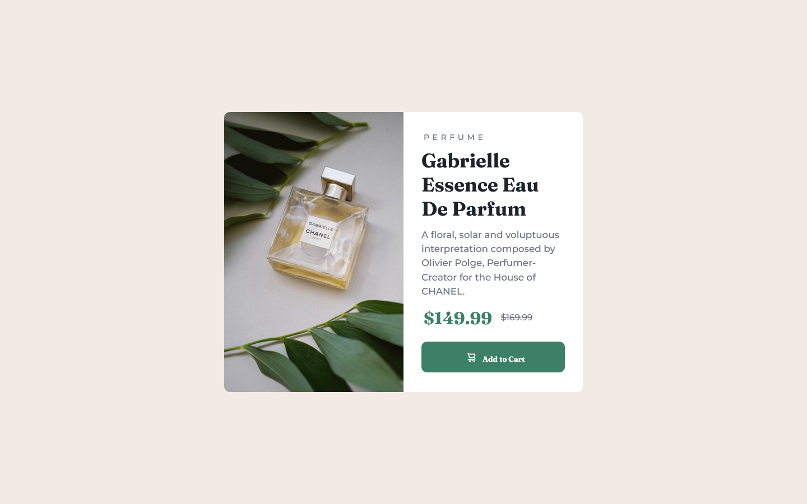

# Frontend Mentor - Product preview card component solution

This is a solution to the [Product preview card component challenge on Frontend Mentor](https://www.frontendmentor.io/challenges/product-preview-card-component-GO7UmttRfa). Frontend Mentor challenges help you improve your coding skills by building realistic projects. 

## Table of contents


  - [The challenge](#the-challenge)
  - [Screenshot](#screenshot)
  - [Links](#links)
- [My process](#my-process)
  - [Built with](#built-with)
  - [What I learned](#what-i-learned)
  - [Continued development](#continued-development)
  - [Useful resources](#useful-resources)
- [Author](#author)


### The challenge

Users should be able to:

- View the optimal layout depending on their device's screen size
- See hover and focus states for interactive elements

### Screenshot




### Links

- Solution URL: [Add solution URL here](https://your-solution-url.com)
- Live Site URL: [Add live site URL here](https://your-live-site-url.com)

## My process
designing mobile first then desktop svaes so much time!


### Built with

- Semantic HTML5 markup
- CSS custom properties
- Flexbox

### What I learned
replacing an elemeent content in css


```css
.proud-of-this-css {
  content: "url ();"
}
```


### Continued development

mastering CSS responisive design and advanced CSS in general.


working on my content sizes when box-sizing is set to border-box!

I learned how o embed an SVG! turns out svg tag doesnt work as well as <embed>

### Useful resources

- [WW3 Schools](https://www.ww3schools.com) - This helped me for XYZ reason. I really liked this pattern and will use it going forward.

## Author

- Frontend Mentor - [@hafsatun2020](https://www.frontendmentor.io/profile/hafsatun2020)


